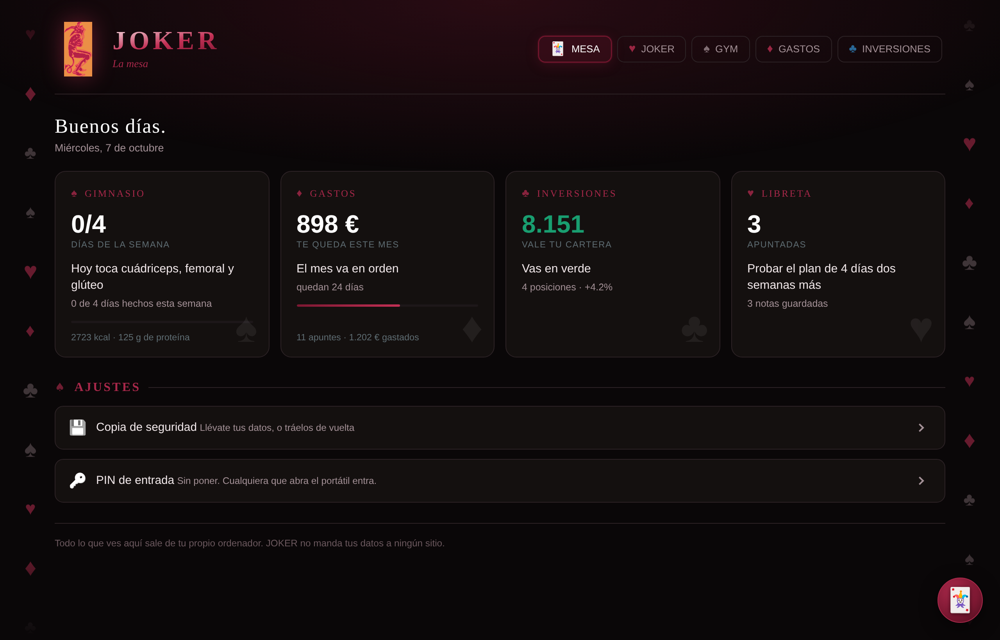
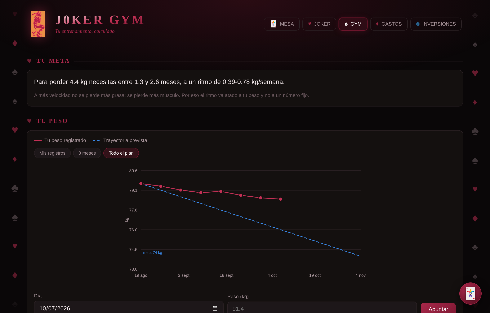
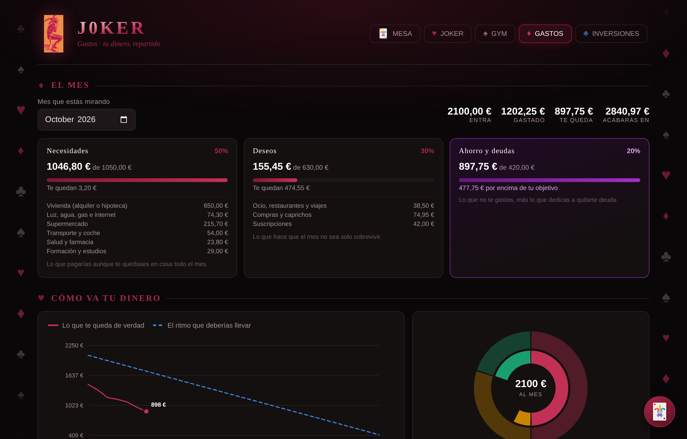
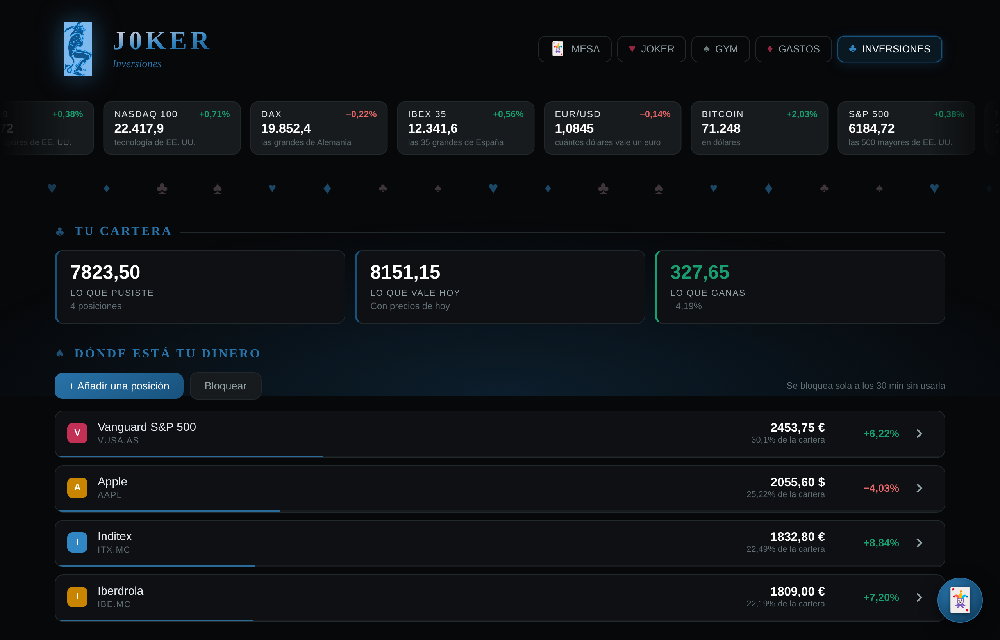
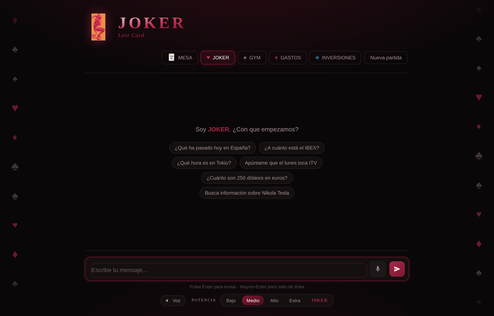

<div align="center">


# JOKER

### *La última carta del mazo*

**Un asistente personal con IA, en castellano, que corre entero en tu ordenador.**

[](https://www.python.org/)
[](https://flask.palletsprojects.com/)
[](https://www.sqlite.org/)
[](LICENSE)
[](#estado)

</div>

---

Pregúntale la hora en Tokio, qué tiempo hace en Madrid o qué ha pasado hoy, y
contesta. Pero además sabe **tus** cosas: cuántos días de gimnasio llevas esta
semana, cuánto te queda del sueldo, cuánto vale tu cartera. Todo sale de tu
disco duro. Nada se manda a ningún sitio salvo la pregunta que le escribes.

Son **cinco salas**, cada una con su palo de la baraja, para que sepas dónde
estás antes de leer la palabra.

> **In English** — JOKER is a Spanish-language personal AI assistant that runs
> entirely on your own machine. A Flask web app with five rooms: an LLM chat
> with 13 tools (function calling via Groq), a gym planner, a monthly budget
> tracker, and an AES-256-GCM encrypted investment portfolio. SQLite for
> storage, no JavaScript frameworks, charts hand-written in SVG. Free tier
> only: no paid APIs anywhere. **Source-available, not open source** — see
> [LICENSE](LICENSE).

---

## Las salas

<div align="center">

</div>

<table>
<tr><td width="52">🃏</td><td><b>LA MESA</b></td><td><code>/mesa</code></td><td>El resumen de todo: lo que toca hoy, lo que te queda, lo que vale tu cartera</td></tr>
<tr><td>♥</td><td><b>JOKER</b></td><td><code>/</code></td><td>El chat con la IA y sus 13 herramientas</td></tr>
<tr><td>♠</td><td><b>J0KER GYM</b></td><td><code>/gym</code></td><td>Rutina, calorías, macros y el peso en una gráfica</td></tr>
<tr><td>♦</td><td><b>J0KER GASTOS</b></td><td><code>/gastos</code></td><td>El sueldo repartido, los gastos del mes y el simulador de deudas</td></tr>
<tr><td>♣</td><td><b>INVERSIONES</b></td><td><code>/inversiones</code></td><td>Tu cartera, cifrada de verdad, y las cotizaciones del día</td></tr>
</table>

<table>
<tr>
<td width="50%"><br><sub><b>♠ GYM</b> · el peso real contra la trayectoria prevista</sub></td>
<td width="50%"><br><sub><b>♦ GASTOS</b> · el reparto del mes y a dónde va el dinero</sub></td>
</tr>
<tr>
<td><br><sub><b>♣ INVERSIONES</b> · la sala cambia a azul, y la cartera se abre con tu contraseña</sub></td>
<td><br><sub><b>♥ JOKER</b> · la pantalla de inicio del chat</sub></td>
</tr>
</table>

<sub>Las capturas llevan **datos inventados**. Los de verdad no salen del ordenador de su dueño.</sub>

---

## Qué sabe hacer la IA

Trece herramientas con *function calling*: el modelo decide cuál usar y con
qué argumentos, y el código las ejecuta de verdad. Ninguna cuesta dinero.

| Herramienta | Qué hace | De dónde saca el dato |
|---|---|---|
| `get_datetime` | La hora en cualquier ciudad del mundo | `zoneinfo`, sin red |
| `get_weather` | Tiempo y temperatura de cualquier sitio | Open-Meteo |
| `calculate` | Cuentas, sin que se las invente | Evaluación controlada |
| `search_web` | Buscar y resumir | Wikipedia |
| `buscar_noticias` | Qué ha pasado hoy | RSS de Google News |
| `cotizacion_bolsa` | A cuánto está un valor o un índice | Yahoo Finance, y Stooq de reserva |
| `convertir_moneda` | Cambio entre divisas | Frankfurter (BCE) |
| `consultar_gym` | Tu rutina, tu peso, tus macros | Tu SQLite |
| `consultar_gastos` | Cuánto te queda, tus deudas | Tu SQLite |
| `consultar_cartera` | Tus posiciones y lo que valen | Tu SQLite, descifrado |
| `guardar_nota` · `leer_notas` · `borrar_nota` | La libreta | Tu SQLite |

Y además: **micrófono y voz**, con el reconocimiento del propio navegador
(Web Speech API). No pasa por ningún servidor, no cuesta nada y no pide clave.

---

## Decisiones que merece la pena contar

Lo que de verdad hay debajo, más allá de la lista de funciones.

**La cartera está cifrada de verdad, no "protegida".** AES-256-GCM, con la
clave derivada de tu contraseña por scrypt (n=2¹⁵). La contraseña no se guarda
en ninguna parte: si la pierdes, no hay recuperación, y eso es exactamente lo
que la hace segura. Durante la sesión vive en un `threading.local()` para que
una petición no pueda ver la clave de otra, y se olvida sola a los 30 minutos.
Si falta la librería `cryptography`, la sala **no arranca**: es preferible que
falle a que guarde en claro lo que prometió guardar cifrado.

**El PIN no finge ser lo que no es.** Se guarda solo la huella scrypt, nunca el
PIN, y se compara con `hmac.compare_digest` para no filtrar nada por el tiempo
de respuesta. Pero la propia pantalla te dice que **es una cortina, no una
cerradura**: quien tenga el fichero `joker.db` lo abre con cualquier visor de
SQLite. Cifrarlo todo obligaría a escribir la contraseña para mirar cuántas
series tocan hoy, y nadie aguanta eso.

**Dos fuentes de bolsa, con relevo.** Yahoo Finance primero, Stooq de reserva.
Salió de un fallo real: la cinta de cotizaciones aparecía vacía y la causa eran
las cabeceras — las dos fuentes rechazan a quien no se presenta como navegador.
Hay un endpoint de diagnóstico que distingue entre "no hay internet", "la
fuente ha cambiado" y "el símbolo está mal escrito", en vez de encogerse de
hombros.

**Los colores están validados, no elegidos a ojo.** La paleta sale de un solo
burdeos (`#7d1832`) rotando el tono y conservando saturación y luminosidad, así
que el contraste se mantiene en las cuatro salas. Las series de las gráficas
pasan un validador de daltonismo, incluido el par que se toca al cerrar el
anillo del donut.

**Las gráficas son SVG escrito a mano.** Cero librerías de JavaScript en todo
el proyecto. La línea de peso contra la trayectoria prevista, el donut del
reparto y las minigráficas de cada posición están dibujadas a mano.

**Las rutinas no pueden lesionarte.** Hay una matriz de limitaciones (hombro,
rodilla, lumbar...) y cada ejercicio tiene alternativa. Se probaron las **2.240
combinaciones** posibles de perfil y limitación: ninguna propone un ejercicio
contraindicado y ninguna deja un hueco sin alternativa.

**Nada de esto cuesta dinero.** Groq en su nivel gratuito, Open-Meteo,
Wikipedia, Google News RSS, Yahoo, Stooq y Frankfurter. Ninguna pide tarjeta.

---

## Probarlo

```bash
pip install -r requirements.txt
cp .env.example .env         # en Windows:  copy .env.example .env
#  -> pega dentro tu clave gratuita de https://console.groq.com/keys
python app.py
```

Y abre <http://127.0.0.1:5000>. Para pararlo, `Ctrl+C`.

Hay también una versión de terminal, sin adornos: `python joker.py`.

---

## Cómo está hecho

```
app.py              El servidor. 55 rutas, Flask.
joker.py            El motor del chat: el bucle de function calling.
tools.py            Las 13 herramientas. No depende de ningún proveedor de IA.

gym.py              Rutinas, calorías, macros y la trayectoria de peso.
gastos.py           Reglas de reparto, avisos y el simulador de deudas.
inversiones.py      La cartera cifrada y las cotizaciones.
acceso.py           El PIN de entrada.
copia.py            Exportar e importar todos tus datos.
mesa.py             El resumen de las cuatro salas.

templates/          Las cinco páginas, más los parciales compartidos.
static/joker.css    La paleta y los componentes, compartidos por las salas.
static/*.js         Las gráficas SVG y la lógica de cada sala.

.githooks/pre-commit            Para el commit si ve una clave o tus datos.
herramientas/revisar-secretos.sh  La misma revisión sobre todo el historial.
```

Unas 13.700 líneas. **Python 3.11+, Flask, SQLite.** Sin React, sin Vue, sin
Tailwind, sin Chart.js: HTML, CSS y JavaScript a mano.

---

## Seguridad y privacidad

Todo se queda en tu disco. El único tráfico que sale es la pregunta que le
escribes al modelo y las consultas a las fuentes públicas de la tabla de
arriba.

- La clave de la API vive en un `.env` que **nunca** entra en git.
- La base de datos y las copias de seguridad, tampoco.
- Un *hook* de pre-commit **para el commit** si detecta una clave o un fichero
  con datos personales, aunque se haya forzado con `git add -f`.
- La cartera, cifrada. El PIN, solo como huella.

El detalle completo —qué está protegido, qué no, y qué hacer si algún día se
filtra una clave— está en la sección **SEGURIDAD** del
[README.txt](README.txt). Para avisar de un problema, [SECURITY.md](SECURITY.md).

---

## Estado

**Funcionando y terminado** en lo que hay. Las cinco salas están completas y
probadas.

Lo que viene, de la lista de ideas del propio proyecto:

- [x] Licencia y términos, para que el código tenga dueño
- [ ] Avisos al móvil si una posición se desploma
- [ ] Wishlist que se revise sola buscando ofertas
- [ ] Un atajo de teclado global que despierte a JOKER
- [ ] Empaquetarlo como aplicación de escritorio

El diario completo del proyecto, con todas las decisiones y por qué se
tomaron, está en [README.txt](README.txt).

---

## Sobre cómo está hecho

Lo desarrollé en pareja con Claude. La idea, los requisitos, el diseño de las
salas y las decisiones de producto son míos; el código salió de ir y venir con
una IA, revisando y corrigiendo. Me parece más honesto contarlo que dejar que
se deduzca del historial de commits, y aprender a dirigir bien una herramienta
así ha sido buena parte de lo que he sacado del proyecto.

---

## Licencia

**Todos los derechos reservados.** © 2026 Roberto
([@rayshadow89](https://github.com/rayshadow89))

Esto es **código visible, no código abierto**. Puedes leerlo, estudiarlo y
evaluarlo. No puedes usarlo, copiarlo, modificarlo ni incorporarlo a otro
proyecto sin mi permiso por escrito. Los términos completos, en castellano y en
inglés, están en [LICENSE](LICENSE).

Dos cosas que conviene decir claras, porque a menudo se confunden:

- La licencia cubre el **código tal y como está escrito**. No cubre las ideas:
  cualquiera puede hacer su propio asistente con estas mismas ideas, siempre
  que lo escriba él. Eso no lo protege ninguna licencia.
- Mientras el repositorio sea público, GitHub permite a cualquiera **verlo y
  bifurcarlo**, y esa función no se puede desactivar. Bifurcar no es tener
  permiso: una bifurcación sigue sujeta a esta licencia.

Si quieres usar algo de aquí, [pídemelo](https://github.com/rayshadow89). Las
peticiones razonadas se contestan.

Es un proyecto personal y no acepta contribuciones. Si encuentras un fallo o
algo que mejorar, una incidencia se agradece igual.
